# 开发环境配置大全

## IDEA

1. 粘贴代码或输入时自动换行4空格
   Settings > Editor > Code Style > Java > Tabs and Indents > Continuation indent : 4
    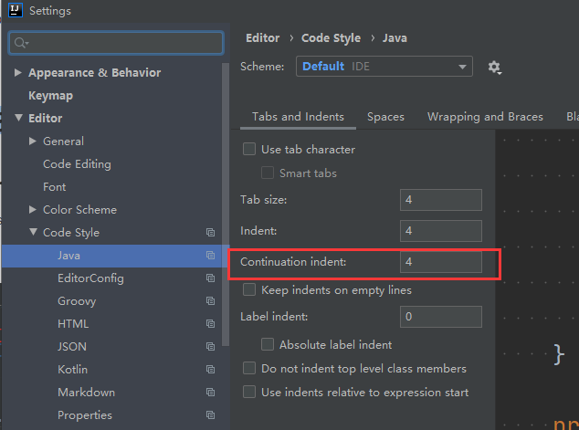
   
2. 避免import多个文件合并为 *
   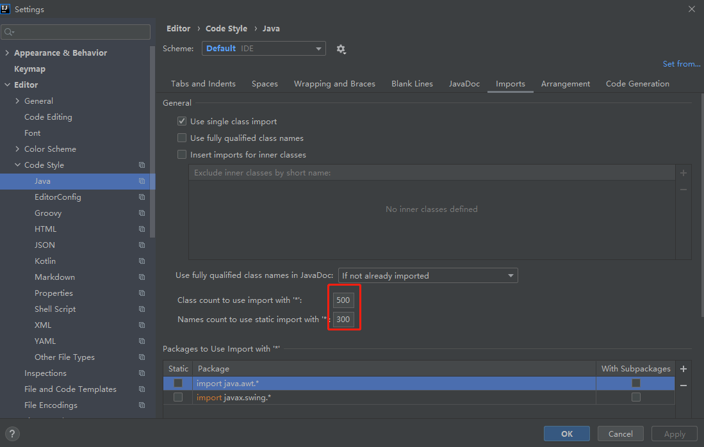

3. 引入Eclipse Code Fomatter

   1. 安装插件 Eclipse Code Formatter. Settings > Plugins > search Eclipse > 找到对应插件 安装 > 重启 IDE 生效
   2. 配置 Formatter config file 选择配置文件
   3. 配置 Import order 选择配置文件

   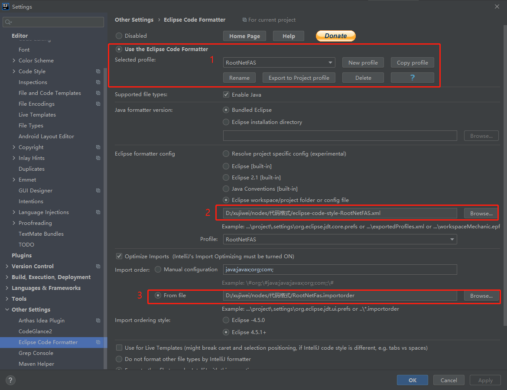

4. 自动import文件

   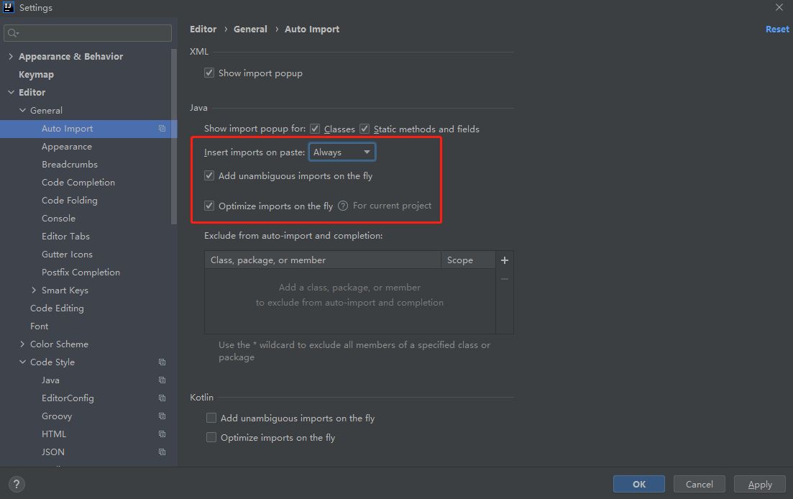

5. import 顺序
   IDEA：
   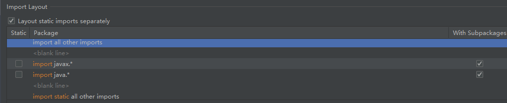
   Eclipse:
   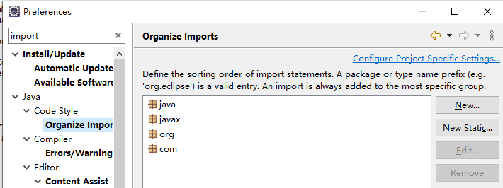
   idea和eclipse几乎是完全相反的，综合一下，可以采用 import static all other imports

   ```java
   import static all other imports
   <blank line>
   import java.*
   <blank line>
   import javax.*
   <blank line>
   import org.*
   <blank line>
   import com.*
   <blank line>
   import com.croot*
   <blank line>
   import all other imports
   ```

6. 常用插件

   1. stackoverflow
   2. JMH
   3. Eclipse Code Formatter
   4. Grep Console
   5. CodeGlance2
   6. Maven Helper 
      参考:https://blog.csdn.net/weixin_41846320/article/details/82697818
   7. maven 2 integration
      用于加载pom.xml中的plugin
   8. Free MyBatis plugin
   9. Lombok
   10. arthas idea

7. 自己的TODO

   1. Settings -> Editor -> TODO 增加自己的规则 和 filter `\bXuJiweiTODO\b.*`

       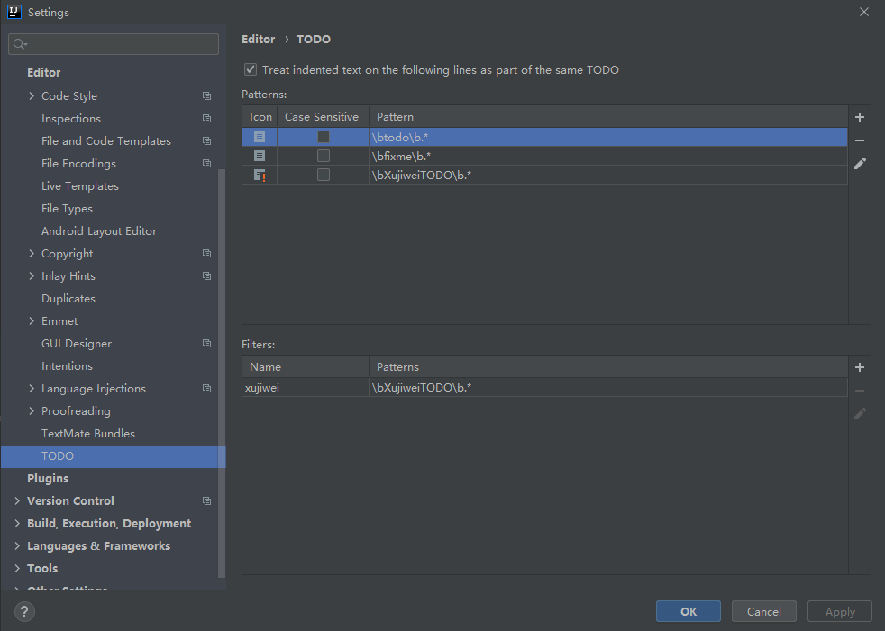

   2. Settings -> Editor -> TODO 增加自己的规则 和 filter

      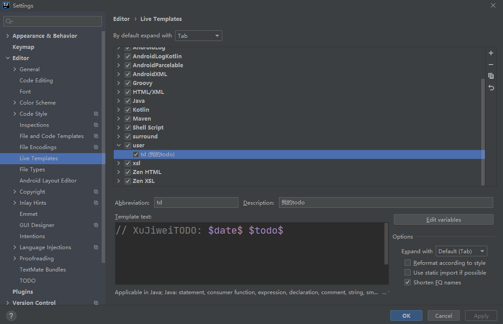

       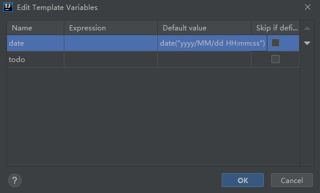

8. IDEA 2020.3.2 不显示侧边栏

   修改方案： 在 `C:\Users\admin\AppData\Roaming\JetBrains\IdeaIC2020.3\options` 目录修改 `ui.lnf.xml` 文件

   ```xml
   <option name="HIDE_TOOL_STRIPES" value="false" />
   或
   <option name="SHOW_TOOL_STRIPES" value="TRUE" />
   ```

    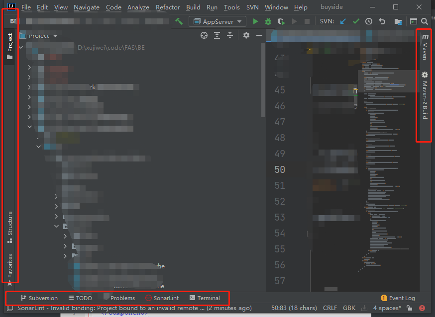

   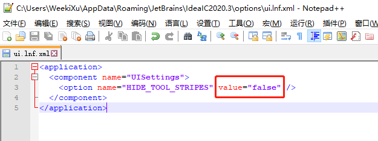


## MAVEN

